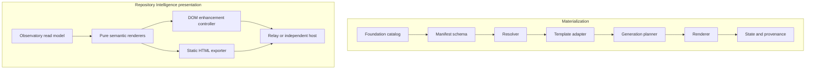

# Holon Architecture

## Purpose and scope

Holon uses a layered, contract-driven architecture. This document owns structural boundaries, dependency direction, integration rules, and current-to-target evolution. Logical responsibilities remain canonical in [SYSTEM.md](SYSTEM.md).

## Layer model

1. **Intent and contracts** — identity, policy, specifications, schemas, and accepted decisions.
2. **Domain** — canonical concepts and pure domain behavior.
3. **Application** — planning, orchestration, use cases, and state transitions.
4. **Adapters** — filesystems, providers, frameworks, renderers, and external tools.
5. **Interfaces** — CLI, library, site, reports, generated artifacts, and automation contracts.
6. **Evidence** — tests, diagnostics, provenance, manifests, and health projections.

Dependencies point inward toward stable contracts and domain behavior. External details do not become canonical domain truth.

## Structural view

The diagram is conceptual. [SYSTEM.md](SYSTEM.md) remains authoritative for responsibilities and implementation evidence determines current availability.

## Dependency rules

- Sibling domain capabilities integrate through versioned public contracts, not direct access to internals.
- Generated artifacts never become the canonical source unless an accepted decision explicitly changes ownership.
- Provider and platform adapters depend on application ports; core behavior does not depend on a provider implementation.
- Read, plan, apply, verify, publish, and recover remain separate authority boundaries when consequential.
- Cross-repository references use releases, immutable commits, schemas, packages, or documented APIs rather than mutable default-branch assumptions.
- Repository Intelligence rendering consumes Observatory query views through a pinned versioned contract. Renderers may derive display-only progress from those views, but they do not collect provider data, infer readiness, redact visibility, or become a second query engine.
- Pure semantic rendering precedes optional DOM enhancement so static exports, framework adapters, and interactive hosts share one HTML contract.
- The generic React/Vite pack enters through the neutral rendered-pack adapter; framework imports and package-manager behavior do not become materialization-engine dependencies.
- LaunchKit extends the versioned React/Vite profile through its own capability and may not turn marketing-page structure into the universal site foundation.
- Ordered overlays are explicit reviewed inputs: the plan records every source-tree digest, later overlays may replace base-owned desired files, and render must receive the same ordered inputs or fail plan verification.
- Structured manifest parameters enter generated typed source as canonical JSON; React owns contextual escaping of visible landing content instead of accepting raw copied HTML.
- Identity supplies reviewed semantic tokens, Egolint supplies policy, and Relay supplies publication automation; the generated application consumes those boundaries without copying their canonical truth.

## Ecosystem interfaces

- Hygiene ontology
- Empathy templates
- Aether bundles
- Realm profiles
- Relay actions
- Pace reconciliation
- future web frontend
- Observatory Repository Intelligence read model
- Relay Repository Intelligence routes

## Deployment and portability

The architecture favors independently usable local and self-hosted operation. Optional managed services may add availability, collaboration, support, and hosted infrastructure without becoming the canonical holder of portable state.

## Evidence and uncertainty

- **Observed:** Foundation resolution, reversible local materialization, and the static-first Repository Intelligence component package are implemented with contract fixtures and tests.
- **Observed:** The `site-react-vite` profile materializes a clean, accessible, deterministic React/Vite application through the existing rendered-pack boundary.
- **Observed:** The `landing-launchkit` profile derives from `site-react-vite` without new dependencies, pre-renders complete semantic HTML, omits unselected sections, and preserves base/overlay provenance across two clean-room consumers.
- **Decided:** Repository Intelligence visuals remain framework-neutral projections over Observatory's versioned public-safe view model; publication stays with Relay or another host.
- **Proposed:** Target systems and later roadmap phases remain proposals until accepted and implemented.
- **Open question:** Which parts of this draft should become active in the first independently versioned release?
