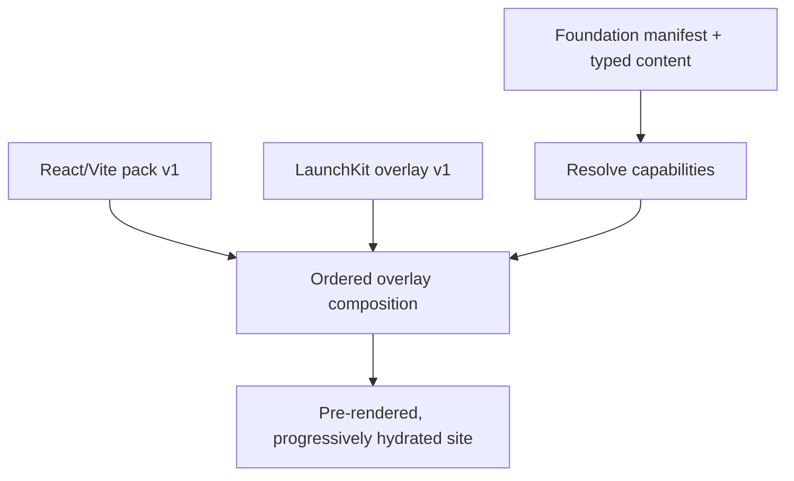

# LaunchKit developer-product blueprint

Status: active

Capability: `landing-launchkit`

Profile: [`blueprints/launchkit/blueprint.json`](../blueprints/launchkit/blueprint.json)

Content schema: [`schemas/launchkit-content.v1.schema.json`](../schemas/launchkit-content.v1.schema.json)

## Purpose

This profile turns the generic React/Vite foundation into a polished,
manifest-driven landing page for a developer tool or open-source product. It is
selectable and derived: repositories that need an application shell without a
marketing surface continue to use `site-react-vite` alone.



The materializer records the SHA-256 identity of both source trees. An overlay
may replace a base-owned path in the composed desired state, but it does not
change the generic source pack or silently copy it into a permanent fork.

## Upstream intake

The reviewed design reference is Evil Martians
[`devtool-template`](https://github.com/evilmartians/devtool-template) at exact
commit `b51f64e1bd88a01608c1561a2d3240f230de4f46`, dated July 24, 2026. The
repository had no tags at audit time.

[`blueprints/launchkit/upstream-audit.json`](../blueprints/launchkit/upstream-audit.json)
records the reviewed file hashes, structure, typography, assets, JavaScript,
responsive behavior, accessibility observations, adapted ideas, excluded
files, and architectural divergences.

The overlay adapts these LaunchKit principles:

- developer-tool information hierarchy;
- wide hero, product proof, feature cards, code example, FAQ, and final CTA;
- CSS custom-property customization;
- static-host-first delivery; and
- native disclosure for FAQ content.

It does not copy LaunchKit HTML, CSS declarations, imperative navigation,
vendored Inter/JetBrains Mono fonts, Font Awesome, placeholder images, client
logos, favicon files, social image, or pricing surface. Every generated
consumer receives `THIRD_PARTY_NOTICES.md` with the pinned upstream commit and
complete MIT notice.

## Typed content contract

Consumers provide one `launchkit_content` object in their foundation manifest.
Holon's bounded template adapter serializes arrays and objects as canonical
JSON, which React assigns to the strict `LaunchKitContent` type. React escapes
human-visible content at render time; consumers do not edit generated section
components.

Required content is intentionally small:

- schema identity;
- project wordmark or optional Identity logo;
- hero positioning and one to three actions;
- one to eight feature cards; and
- footer summary, grouped navigation, and legal links.

The following sections are optional and disappear without empty wrappers:

| Section | Content supplied |
| --- | --- |
| Announcement | Label and release/news URL |
| Proof | Short trust statement and proof labels |
| Demo | Description, optional Identity asset, and bounded metrics |
| Use cases | Heading and product-specific cards |
| Code | Language label and literal CLI/code example |
| Architecture | Ordered how-it-works cards |
| Integrations | Linked ecosystem cards |
| Trust | Security, accessibility, policy, or release links |
| FAQ | Native `details` question/answer records |
| Final CTA | Closing copy and one to three actions |

Top-level parameters continue to own package identity, canonical URL, base
path, title, description, and Identity stylesheet. The LaunchKit profile adds
reviewed Identity favicon and social-image URLs. URLs must be HTTPS,
root-relative, or same-page fragments; placeholder copy is rejected.

## Static and progressive output

The browser build retains the exact React/Vite dependency graph from the base
profile. LaunchKit adds no runtime or development dependency.

During `pnpm build`:

1. Vite produces the normal client bundle.
2. Vite produces a temporary server-render entry.
3. React renders the complete selected landing content into `dist/index.html`.
4. The temporary server bundle is removed.
5. The static-host `404.html` is copied byte-identically.
6. JavaScript, CSS, and HTML byte budgets are enforced.

The browser progressively hydrates that markup. Heading hierarchy, navigation,
feature content, code, trust links, FAQ, footer, and optional sections therefore
remain readable before client JavaScript executes. Navigation wraps on narrow
screens without a custom menu controller; FAQ interaction uses the native web
platform.

The v1 budgets are:

| Output | Maximum bytes |
| --- | ---: |
| JavaScript | 225,000 |
| CSS | 30,000 |
| HTML | 100,000 |

## Ownership boundaries

| Concern | Owner and current behavior |
| --- | --- |
| Foundation/toolchain | Holon's `site-react-vite` profile |
| Landing IA/components | Holon's `landing-launchkit` overlay |
| Brand tokens/assets/copy metadata | Identity inputs supplied by the consumer |
| JavaScript/architecture policy | Egolint consumer manifest and adapters |
| Publication workflow | Relay's `relay-ci` capability |
| Documentation | Linked Zensical sibling profile; not copied into React |
| Agent-Ready Web | Reserved composition slots for open issues #7–#10 |
| Legal/policy routes | Consumer links now; reusable projection remains issue #11 |
| Fleet reconciliation | Pace after repository-level materialization |

The open Agent-Ready Web and legal issues remain explicit `contract-pending`
integration slots. This profile does not claim their routes or duplicate their
policy sources.

## Materialize the composed profile

Plan with the generic pack followed by the reviewed LaunchKit overlay:

```sh
python3 tools/holon_materialize.py plan \
  --manifest "examples/launchkit-optiflow.manifest.json" \
  --target "/tmp/optiflow-site" \
  --aether-source "/path/to/pinned/aether/dist" \
  --render-source "blueprints/react-vite/files" \
  --render-overlay "blueprints/launchkit/files" \
  --output "/tmp/optiflow-site.plan.json"
```

Review the plan and render with the same ordered inputs:

```sh
python3 tools/holon_materialize.py render \
  --plan "/tmp/optiflow-site.plan.json" \
  --target "/tmp/optiflow-site" \
  --aether-source "/path/to/pinned/aether/dist" \
  --render-source "blueprints/react-vite/files" \
  --render-overlay "blueprints/launchkit/files"
```

Changing the base pack, overlay bytes, manifest content, Aether evidence, or
target after planning changes the plan identity and blocks rendering.

## Pilot evidence

Two clean-room fixtures prove that customization is content-driven:

- [`launchkit-optiflow.manifest.json`](../examples/launchkit-optiflow.manifest.json)
  selects the full section model for a media pipeline, including proof, demo,
  architecture, integrations, trust, and FAQ.
- [`launchkit-mantle.manifest.json`](../examples/launchkit-mantle.manifest.json)
  selects a smaller workstation-tool story and omits proof, demo, architecture,
  integrations, and FAQ cleanly.

Run both with the pinned package manager:

```sh
corepack_directory="$(mktemp -d)"
corepack enable --install-directory "$corepack_directory"
PATH="$corepack_directory:$PATH" python3 tools/check_launchkit_fixtures.py
```

For each fixture the proof performs clean materialization, provenance checks,
no-op replanning, frozen installation, format/lint/cycle/type/test gates,
pre-rendering, performance budgets, local asset and fragment validation,
byte-reproducible rebuilding, semantic HTML/CSS visual snapshots, and a live
Vite preview.

## Upstream reconciliation

LaunchKit updates are deliberate intake events, not template pulls:

1. Fetch the new upstream commit without mutating the pinned audit.
2. Diff the reviewed upstream files and record new hashes and behavior.
3. Classify changes as adapted principle, irrelevant upstream implementation,
   or required Holon divergence.
4. Review license/attribution and dependency changes.
5. Update the pinned commit, audit, notice, overlay version, and inventory in
   one bounded PR.
6. Refresh visual snapshots only after reviewing both pilot diffs.
7. Run the complete clean-room proof before release or consumer rollout.

Individual product migrations remain downstream work. They must consume a
released profile and provide their own Identity/content inputs rather than
forking these internals.
