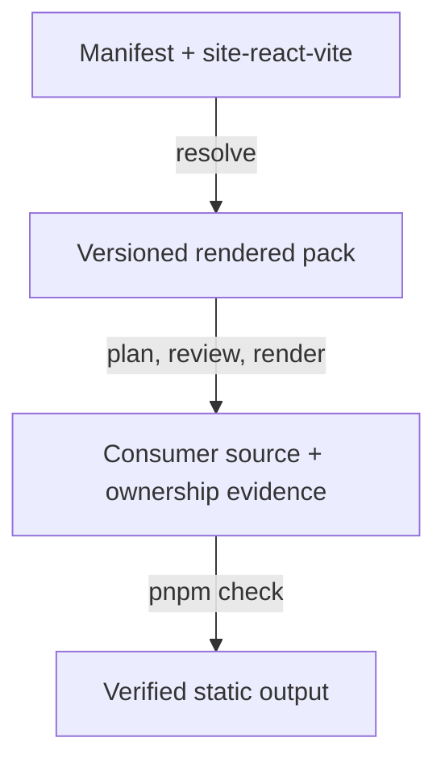

# Generic React/Vite blueprint

Status: active

Capability: `site-react-vite`

Profile: [`blueprints/react-vite/blueprint.json`](../blueprints/react-vite/blueprint.json)

Schema: [`schemas/react-vite-blueprint.v1.schema.json`](../schemas/react-vite-blueprint.v1.schema.json)

## Purpose

The React/Vite blueprint is Holon's smallest production-quality foundation for
interactive sites and applications. It is a versioned rendered pack consumed by
the existing plan/render/verify/rollback engine; React and Vite do not enter the
core materializer.



The blueprint is not a universal visual design and not a LaunchKit fork. Issue
#15 composes the separate LaunchKit profile from this foundation.

## Versioned toolchain

The v1 profile pins:

| Boundary | Version |
| --- | --- |
| Node.js | `>=24.15.0` |
| pnpm | `11.24.0` |
| React / React DOM | `19.2.8` |
| Vite | `8.2.2` |
| TypeScript | `7.0.2` |
| Vitest | `4.1.11` |

All package versions are exact and the rendered pack includes a frozen
`pnpm-lock.yaml`. The profile inventory records every template file by SHA-256.
Changing template bytes requires refreshing and reviewing that inventory:

```sh
python3 tools/react_vite_blueprint.py --write-inventory
python3 tools/react_vite_blueprint.py
```

## Manifest contract

A repository opts in through the `site-react-vite` capability and supplies six
scalar parameters:

| Parameter | Meaning |
| --- | --- |
| `package_name` | Safe private npm package identity |
| `site_title` | Human-visible title and metadata source |
| `site_description` | Human-visible summary and metadata source |
| `canonical_url` | Absolute HTTPS publication identity |
| `site_base_path` | Leading- and trailing-slash Vite/host base path |
| `identity_stylesheet` | Reviewed semantic-token stylesheet import |

[`examples/react-vite-site.manifest.json`](../examples/react-vite-site.manifest.json)
is the canonical clean-room fixture. It deliberately excludes
`landing-launchkit`, proving that the generic foundation is independently
useful.

Materialize it through the existing neutral rendered-pack adapter:

```sh
python3 tools/holon_materialize.py plan \
  --manifest "examples/react-vite-site.manifest.json" \
  --target "/tmp/example-react-vite-site" \
  --aether-source "/path/to/pinned/aether/dist" \
  --render-source "blueprints/react-vite/files" \
  --output "/tmp/example-react-vite-site.plan.json"
```

The normal explicit render and verify commands apply after plan review. Holon
retains the same no-clobber, digest, provenance, and rollback boundaries as any
other rendered pack.

## Generated application boundary

The generic source provides:

- strict TypeScript and a minimal React/Vite shell;
- explicit home, about, not-found, and render-error states;
- skip navigation, landmarks, focus visibility, keyboard-safe navigation, and
  semantic server-rendered accessibility smoke tests;
- responsive light/dark/high-contrast tokens and reduced-motion behavior;
- canonical metadata, a web manifest, and a no-JavaScript fallback;
- configurable Vite base paths and a byte-identical `dist/404.html` static-host
  fallback;
- deterministic production builds and a real preview-server smoke test.

The fallback stylesheet is neutral and unbranded. A consumer points
`identity_stylesheet` at reviewed Identity output; framework-local CSS never
becomes canonical brand truth.

## Quality ownership

The pack emits `egolint.javascript-package-quality.json` with the React profile
and explicit `private` publication state. The generated adapter versions match
Egolint's accepted Oxlint, oxlint-tsgolint, Biome, and dependency-cruiser
decisions. Holon does not copy Egolint's rule policy.

Local and CI execution share one command:

```sh
pnpm check
```

It runs formatting/import checks, native lint diagnostics, strict type checks,
unit/accessibility smoke tests, and the production build. Relay or another
consumer should additionally invoke the canonical Egolint contract and consume
its normalized reports. Because dependency-cruiser does not yet parse
TypeScript 7 directly, the cycle check cruises an ephemeral JavaScript mirror
produced by the pinned TypeScript compiler and always removes it afterward.

## Capability exclusions

The baseline intentionally excludes:

- LaunchKit sections and presentation;
- Storybook unless a selected component-development profile needs it;
- publint unless a package is explicitly publishable;
- Chalk without the Node CLI rich-output capability;
- `source-map-support`, because modern Node support is native; and
- Visibility.js, because the browser platform already owns that behavior.

Agent-Ready Web artifacts, legal surfaces, documentation, Realm development
environments, Relay workflows, and Identity packages remain composed
capabilities owned by their respective contracts.

## Acceptance proof

Run the complete disposable integration:

```sh
corepack_directory="$(mktemp -d)"
corepack enable --install-directory "$corepack_directory"
PATH="$corepack_directory:$PATH" python3 tools/check_react_vite_fixture.py
```

The check resolves the canonical manifest, materializes a clean directory,
verifies Holon ownership, proves the second plan is all no-ops, performs a
frozen install, runs `pnpm check`, injects and rejects a real circular import,
compares two complete build-tree digests, verifies static references and
fallback output, and starts the real Vite preview server.
