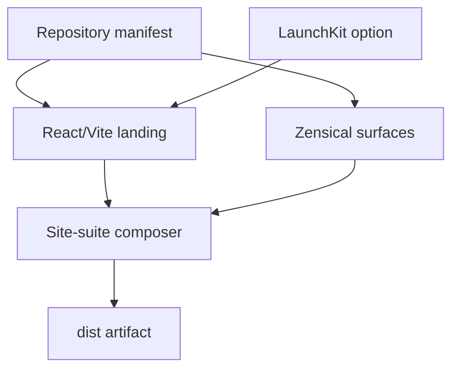

# Holon public site-suite blueprint

Issue #4 composes one selectable landing profile with durable documentation,
architecture, and legal surfaces. It does not merge the source ownership of
those systems. A consumer selects capabilities and supplies reviewed content;
Holon materializes the governed files and produces one Relay-ready artifact.

## Profile topology



The landing choice is independent of the content surfaces:

| Variant | Capabilities | Ordered rendered inputs | Proof consumer |
| --- | --- | --- | --- |
| Generic | `site-react-vite`, `docs-zensical` | React/Vite base, Zensical overlay, suite overlay | Holon |
| LaunchKit | `site-react-vite`, `landing-launchkit`, `docs-zensical` | React/Vite base, LaunchKit overlay, Zensical overlay, suite overlay | OptiFlow |

Both variants emit the same public route contract:

| Surface | Route | Source boundary |
| --- | --- | --- |
| Landing | `/` | Selected React/Vite or LaunchKit profile |
| Documentation | `/docs/` | Zensical from reviewed `site_suite_content.documentation` |
| Architecture | `/architecture/` | Zensical from reviewed architecture content and Mermaid source |
| Legal | `/legal/` | Zensical projection of consumer-provided reviewed policy content |

## Consumer contract

`schemas/site-suite-content.v1.schema.json` is the closed structured-content
contract. It requires product metadata plus non-empty documentation,
architecture, and legal collections. Page slugs, decision identifiers, URLs,
and legal update dates are validated before generation. Unknown properties,
unresolved Holon tokens, placeholder copy, unsafe local references, duplicate
HTML identifiers, and broken fragments fail the suite check.

Scalar values that must remain valid inside quoted source use
`{{parameter_json.<key>}}`. Structured values use canonical JSON through the
existing parameter substitution boundary. Consumers change manifest inputs,
not generated Python, React, templates, or Zensical configuration.

The complete composition profile is
`blueprints/site-suite/blueprint.json`. The two executable manifests are
`examples/site-suite-generic.manifest.json` and
`examples/site-suite-optiflow.manifest.json`.

## Zensical intake

The `docs-zensical` profile pins Zensical `0.0.57`, tag `v0.0.57`, peeled
commit `f18bb9957cb2740e5dd66d4a438c780b4e15d64c`, and its MIT license digest.
`blueprints/zensical/upstream-audit.json` records the reviewed package and
bootstrap configuration hashes. The Python dependency graph is universal and
fully hash-pinned in `site-docs/requirements.lock.txt`.

Zensical is currently alpha. Every version change therefore requires explicit
upstream, dependency-lock, rendered-inventory, accessibility, and artifact
review. Version `0.0.57` emits a nested fallback page whose skip-link fragment
does not exist. The adapter deliberately excludes those nested `404.html`
files and keeps the selected landing profile's verified root fallback. This is
a bounded, tested divergence from native output.

Zensical builds documentation, architecture, and legal content through three
isolated native TOML configurations. This prevents one navigation tree from
silently becoming the canonical information architecture for every surface.

## Commands

Validate the profiles and their composition contract:

```bash
python3 tools/react_vite_blueprint.py
python3 tools/launchkit_blueprint.py
python3 tools/site_suite_blueprint.py
```

Execute both clean-room consumers with the pinned Node package manager and
hash-pinned Python graph:

```bash
corepack_directory="$(mktemp -d)"
corepack prepare "pnpm@11.24.0" --activate
corepack enable --install-directory "$corepack_directory"
PATH="$corepack_directory:$PATH" python3 tools/check_site_suite_fixtures.py
```

Inside a materialized consumer, build and verify all surfaces:

```bash
python3 -m venv ".venv"
".venv/bin/python" -m pip install \
  --disable-pip-version-check \
  --require-hashes \
  --requirement "site-docs/requirements.lock.txt"
pnpm install --frozen-lockfile --ignore-scripts
".venv/bin/python" site_suite.py check
```

Preview the exact `dist` artifact locally:

```bash
".venv/bin/python" site_suite.py preview \
  --host "127.0.0.1" \
  --port 8000
```

The fixture proof materializes from an empty directory, verifies Holon
ownership, requires a no-op replan, installs both frozen dependency graphs,
runs formatting/lint/types/tests, builds twice byte-identically, validates the
complete static-reference and accessibility contract, and requests all four
routes from a live local server. Reviewed tree digests live in
`tests/fixtures/site-suite/artifact-contracts.json`.

## Ownership and adoption boundaries

| Concern | Canonical owner | Holon behavior in this profile |
| --- | --- | --- |
| Product visual identity | Identity | Consumes reviewed stylesheet, favicon, and metadata inputs |
| Architecture truth | Hygiene and consumer source | Projects reviewed content; does not redefine truth |
| Landing implementation | Holon React/Vite or LaunchKit profile | Selects one independently versioned renderer |
| Documentation rendering | Holon Zensical profile | Generates bounded Markdown/configuration and static output |
| Legal policy | Consumer policy owner | Projects supplied reviewed content; reusable source adapter remains issue #11 |
| Quality policy | Egolint | Executes the local adapter without copying canonical policy |
| Publication and rollback | Relay | Emits a deterministic `dist` artifact for GitHub Pages |
| Reconciliation | Pace | Leaves fleet application and reconciliation outside materialization |
| Visibility evidence | Observatory | Leaves collection, normalization, and visibility outside the renderer |

Agent-Ready Web issues #7 through #10 remain contract-pending. This blueprint
does not speculate about those outputs.

Identity issues #56 and #57 are downstream architecture decision and
dogfooding work. Antidote adopts the proven profiles only after that boundary
is exercised. Neither downstream repository is modified by issue #4, and
future adoption must preserve each consumer's routes, checksums, provenance,
and reproducibility contracts.
